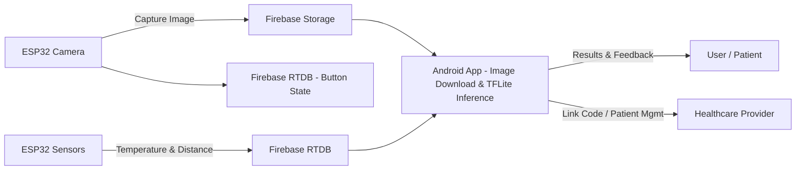

# Detectoma: Skin Cancer Detection App

**Detectoma** is an Android-based solution to assist in the early detection and monitoring of potential skin cancers (e.g., melanoma). It integrates both **hardware** (ESP32 microcontrollers) and **software** (Android app with Firebase and TensorFlow Lite) to collect patient data, capture and analyze images of moles, and generate insights for users and healthcare providers.

---

## Table of Contents

1. [Overview](#overview)
2. [In Action](#in-action)
3. [Features](#features)  
4. [Architecture](#architecture)  
5. [Tech Stack](#tech-stack)  
6. [Setup & Installation](#setup--installation)  
7. [Usage Flow](#usage-flow)  
8. [Hardware Details](#hardware-details)  
9. [Disclaimer](#disclaimer)

---

## Overview

Modern health applications can leverage computer vision and machine learning for early intervention. **Detectoma** provides:

- **Android-based patient interface** where users can record mole observations, answer a short ABCDE questionnaire, and capture images via a specialized ESP32 camera.
- **Thermal and distance measurements** using a second ESP32 with sensors, helping monitor mole growth and temperature variations.
- **Cloud integration with Firebase** for secure data storage and real-time updates.
- **On-device machine learning** using TensorFlow Lite to classify suspicious lesions and produce a heatmap overlay for visual inspection.

The primary goal is not to replace medical advice but to assist patients and doctors in early detection and monitoring.

---

## In Action

[](https://www.youtube.com/watch?v=e1WFpqt1OUI)

---

## Features

1. **User-friendly Sign Up & Login**  
   - Firebase Authentication for patient and doctor accounts.  
   - Email verification to ensure account validity.

2. **Questionnaire & ABCDE Assessment**  
   - Asymmetry, Border, Color, Diameter, Evolving (ABCDE) checks.  
   - Real-time instructions/explanations for each criterion.

3. **Mole Image Capture**  
   - ESP32 camera captures mole photos and uploads to Firebase Storage.  
   - Android app automatically retrieves the latest photo and stores it locally for analysis.

4. **Thermal & Distance Measurements**  
   - ESP32 with MLX90614 IR temperature sensor for local (mole) temperature changes.  
   - Ultrasonic sensor-based distance measurement for mole size/growth tracking.  
   - Automatic charting of temperature readings in the Android app.

5. **AI-based Analysis**  
   - TensorFlow Lite model identifies suspicious lesions (Positive/Negative).  
   - Integrated Class Activation Map (CAM) to highlight crucial regions in the image.  
   - Overlays heatmap on user’s photo for better interpretability.

6. **Patient-Doctor Link**  
   - Providers can generate a unique code to link patient accounts.  
   - View patient screenings, unlink if necessary, and manage multiple patient profiles.

7. **Firebase Integration**  
   - Realtime Database for user info, screening data, and sensor readings.  
   - Cloud Storage for securely storing images.  
   - Automated triggers for data upload and retrieval.

---

## Architecture


1. **ESP32 Camera**: Takes pictures, saves them to Firebase Storage.
2. **ESP32 Sensors**: Reads temperature & distance, stores results in Firebase Realtime Database.
3. **Android App**: Fetches images from Storage, merges sensor data from RTDB, runs inference, and displays results with an ABCDE-based questionnaire.
4. **Healthcare Provider**: Can link to patient accounts, view data, and unlink when necessary.

---

## Tech Stack

* Android (Java):
  * Android Studio, Gradle.
  * TensorFlow Lite for on-device ML.
  * Firebase services (Authentication, RTDB, Storage).
* Hardware:
  * ESP32-CAM for image capture.
  * ESP32 board for sensors (MLX90614 IR sensor & Ultrasonic sensor).
* Firebase:
  * Authentication for login/signup.
  * Realtime Database for sensor data, linking, profiles.
  * Storage for images captured by ESP32 camera.
* Build Tools:
  * Arduino IDE or PlatformIO for ESP32 code.
  * Gradle for Android.

---

## Setup & Installation
# Prerequisites
1. **Hardware**:
  * ESP32-CAM module (OV2640 camera).
  * ESP32 board for sensors (MLX90614 IR sensor, ultrasonic sensor).
  * Basic electronics assembly for push button, voltage setup, etc.
2. **Software**:
  * Arduino IDE or PlatformIO.
  * Android Studio.
  * Firebase project created with the necessary APIs enabled:
    * Realtime Database
    * Storage
    * Authentication (Email/Password)
3. **Credentials**:
  * Wi-Fi SSID and Password for ESP32 boards.
  * Firebase project configuration (API keys, Database URL, etc.).

## Steps

1. **Clone the Repository**
```bash
   git clone https://github.com/YourUsername/Detectoma.git
   cd Detectoma
```
2. **Android App**
* Open the Detectoma folder in Android Studio.
* Update your google-services.json file in app/ with your Firebase project config.
* Confirm API_KEY, DATABASE_URL, and STORAGE_BUCKET_ID in relevant files (e.g., MainActivity.java, resultsActivity.java, or strings.xml if utilized).
* Sync Gradle and run the project on your device/emulator.

3. **ESP32 Camera**
* Update the Wi-Fi credentials, Firebase project details, and user credentials (USER_EMAIL, USER_PASSWORD) in the ESP Code.
* Select the appropriate ESP32 board & COM port.
* Upload the sketch.

4. **ESP32 Sensors**
* Update the Wi-Fi credentials, database URL, and relevant paths.
* Ensure you have the required libraries installed:
* Adafruit_MLX90614 for IR temperature sensor.
* FirebaseClient (or whichever library used) for communication.
* Upload the sketch.

5. **Run the App & Power the ESP32 Boards**
* Both ESP32 boards should connect to your Wi-Fi and start sending/receiving data.
* The Android app will fetch sensor data and images from Firebase for analysis.

---
## Usage Flow

### **User Registration / Login**
1. Open the app and click **Sign Up** or **Login**.
2. If you are a new user, fill out the required details and verify your email.

### **Complete a Screening**
1. After logging in, navigate to **Start Screening**.
2. Fill out the **ABCDE questionnaire** via `UserDataActivity`.
3. Capture a photo using the **ESP32-CAM** through `TakePhotoActivity`.
4. Measure temperature and distance using:
   - `TakeTempActivity` (IR temperature measurement)
   - `takeDistanceActivity` (Ultrasonic distance measurement)
5. Save all data to **Firebase** and view AI analysis results in `resultsActivity`.

### **Results & Heatmap**
- The app runs a **TensorFlow Lite inference** and displays a heatmap overlay.
- Users can **toggle the heatmap** to highlight suspicious areas.
- A textual explanation is shown if:
  - Any **ABCDE flags** are raised.
  - The AI indicates a **high risk**.

### **Healthcare Provider Portal**
- Providers can log in with designated credentials (e.g., `doctor@detectoma.com`).
- Providers can:
  - Generate a code to **link patient accounts**.
  - View **patient screening histories**.
  - Unlink patient accounts if needed.

---

## Hardware Details

### **ESP32-CAM**
- **Camera Sensor**: OV2640
- Captures **JPEG images** and uploads them to **Firebase Storage**.

### **ESP32 with Sensors**
- **Adafruit MLX90614**: For IR temperature measurement.
- **Ultrasonic Sensor (HC-SR04)**: For distance measurement.
- **Push Button**: Toggles the measurement process.

> Ensure proper pin connections and provide a stable power supply for reliable hardware operation.

---

## Disclaimer
The Detectoma app is intended as an aid, not a replacement for professional medical advice. Always consult a licensed medical professional for accurate diagnosis and treatment.
